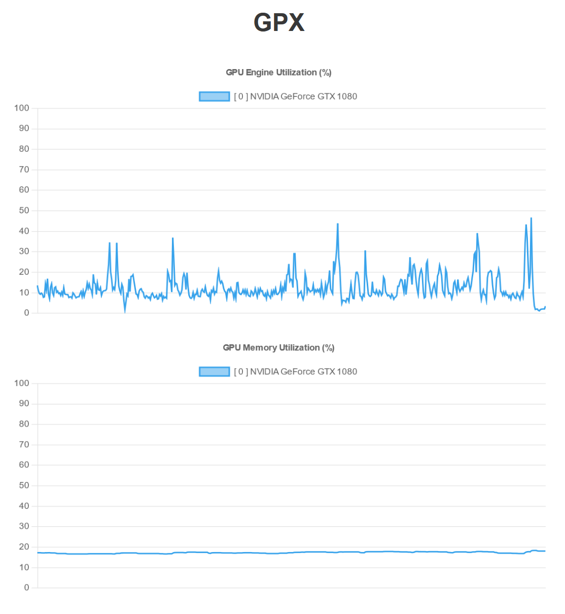

<h1 align=center>GPX</h1>

GPX is a graphical GPU monitoring utility which allows to inspect system-wide GPU utilization in the web browser via a TCP/HTTP API. This is very handy for timeseries analysis on headless systems such as server distributions. It natively supports **all GPU vendors and OS platforms**.

<p align=center></p>

## Usage

### Run Server
To quickly start a server use the project template in root directory 

```python
python run_server.py
```
```bash
>> 📡 serving GPX server at http://192.255.178.24:8080
```

The web dashboard can then be accessed at this URL.

### API Backend Endpoint

Use the API endpoint to get data in backend.

```python
import requests

# your host credentials
IP = 'HOST IP ADDRESS'
port = 8080

url = f'http://{IP}:{port}/'

# request data
data = requests.post(url, json={}).json()
print(data)
```

### Python Import

```python
#!/usr/bin/python3
from GPX import gpx_server, GPX

if __name__ == '__main__':
    
    # run a GPX web server 
    gpx_server(frequency=10, max_aggregation_length=500, port=8080)
```